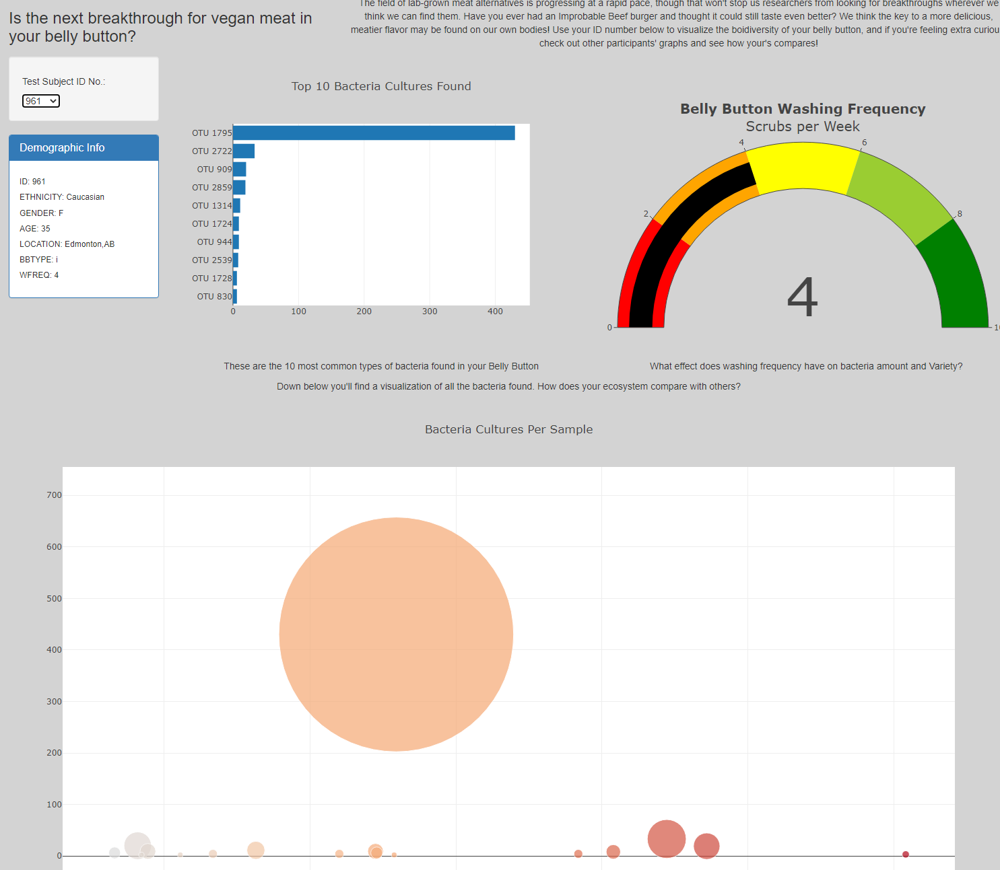

# Belly_Button_Bio
## Overview
A dynamic webpage for visualizing bacteria and demographic information of individual test subjects.
## Functionality
Upon loading, the webpage shows data for individual no.940, with three graphs and a table of demographic information:

On the left above the demographic table, there is a dropdown menu that allows the user to filter the data by ID no. When changed, the graphs and tables update with the different data:

The page also has a contextulization paragraph and header and little descriptions of each visualization.
## Future Updates
There's always more ways to prettify a webpage, and this one is no exception. For instance, this page could potentially be updated with information and styling from Improbable Beef's website.
Another future improvement could be within the data analyzing itself. As is, this is only a visualization. Dynamic tables, ability to compare test subjects could be among future improvements that could help future analysis.